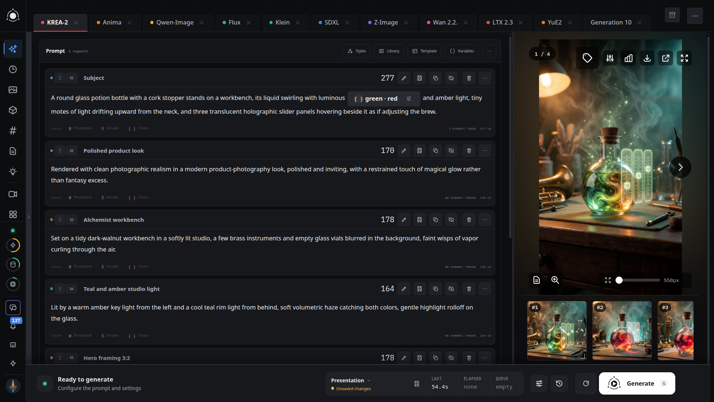
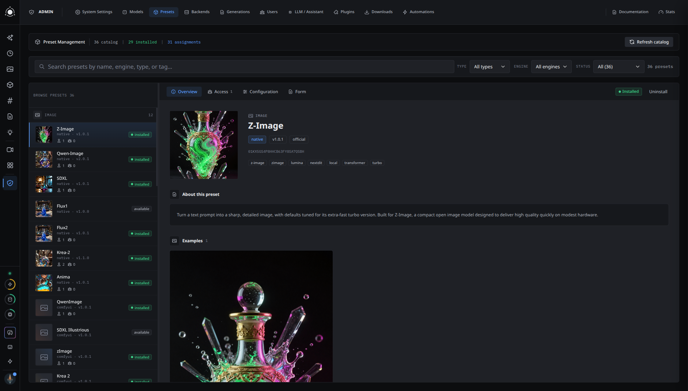
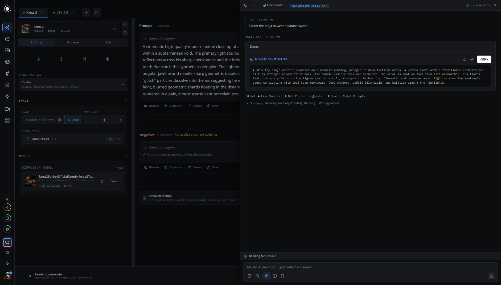
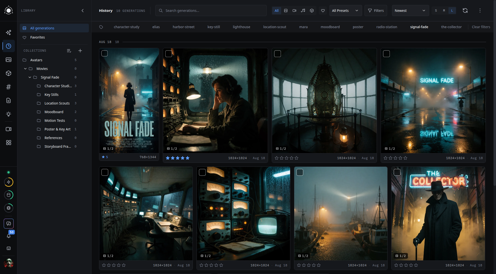
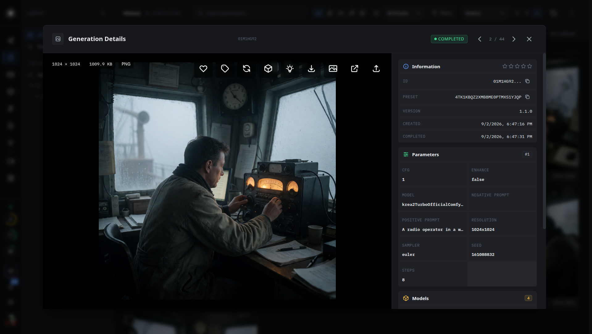
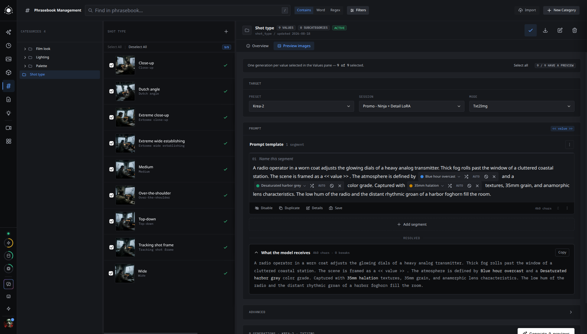
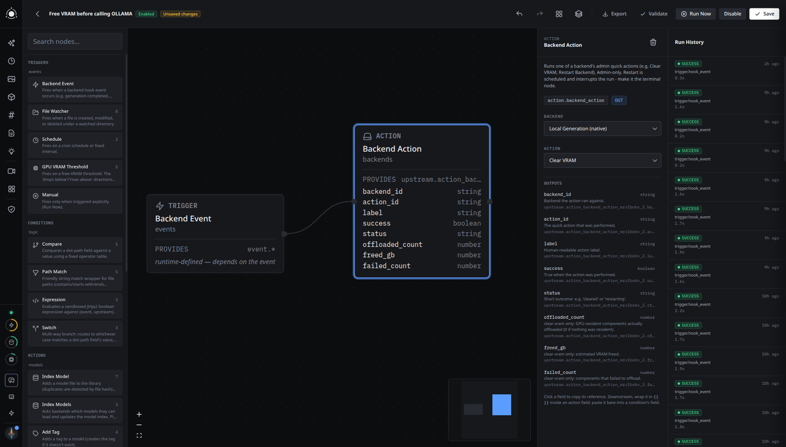

# PotionUI

[](https://ko-fi.com/A3B325D031)
[](https://discord.gg/avR4trp3b8)
[](LICENSE)
[](#)

**The self-hosted generation studio you can hand to other people.**

Run Flux, Wan, LTX, Qwen-Image and MiniMax on one box — then give your team,
your household, or your agents their own logins, presets, and limits. No node
graphs. No per-model setup. Pick a model, type, watch it render live.



<details>
<summary>Watch the 60-second tour (video)</summary>

https://github.com/user-attachments/assets/950415f7-da97-403e-811b-4c9c41d8106f

</details>

**Why PotionUI:**

- **Forms, not wiring** — each model exposes only the controls it actually
  understands.
- **Accounts, groups, admin panel** — one GPU, many users, per-user presets
  and model access.
- **Drive it from Claude Desktop or any MCP client** — per-user tokens; every
  write action needs your approval.
- **Video and Music Directors** — compose shots and songs in sections instead
  of one giant prompt.

*Alpha 0.0.3 · Linux x86_64 + NVIDIA · Windows via WSL2 or Docker ·
[Discord](https://discord.gg/avR4trp3b8) · [Ko-fi](https://ko-fi.com/A3B325D031)*

## 60 seconds to first image

```bash
git clone https://github.com/PotionUI/PotionUI.git potionui && cd potionui
./potionui doctor    # check prerequisites, with a repair command for anything missing
./potionui start     # create the venv, install deps, launch backend + frontend, print the URL
```

Floor: 8 GB VRAM + 16 GB RAM (SDXL). Full requirements below.

## Contents

- [What you're looking at](#what-youre-looking-at)
- [Multi-user, with an admin panel](#multi-user-with-an-admin-panel)
- [AI assistant](#ai-assistant)
- [The generate workspace](#the-generate-workspace)
- [History, tags, and collections](#history-tags-and-collections)
- [Video Director](#video-director) · [Music Director](#music-director)
- [Prompt tooling](#prompt-tooling)
- [Automations](#automations)
- [Plugins](#plugins)
- [Install](#install) — [supported platforms](#supported-platforms),
  [manual setup](#running-backend-and-frontend-separately)
- [Documentation](#documentation) · [Changelog](#changelog)
- [Contributing](#contributing) · [Support](#support) · [License](#license)

## What you're looking at

- **Pick a model, get the right controls** — each model ships a form with only
  the controls it understands: resolution, camera angle, art style, whatever
  applies.
- **Watch it happen live** — step-by-step progress, streaming previews, and a
  gallery that fills in as results land.
- **One app for all of it** — images, video, and audio side by side, no
  per-model setup.

| Model family       | What it does                      | Docs                                                           |
| ------------------ | --------------------------------- | -------------------------------------------------------------- |
| SDXL               | Image (txt2img, inpaint)          | [docs/models/sdxl.md](docs/models/sdxl.md)                     |
| Flux (1 / 2 Klein) | Image (txt2img, img2img)          | [docs/models/flux.md](docs/models/flux.md)                     |
| Qwen-Image         | Image (txt2img, img2img, edit)    | [docs/models/qwen_image.md](docs/models/qwen_image.md)         |
| Krea-2             | Image (txt2img, enhance)          | [docs/models/krea2.md](docs/models/krea2.md)                   |
| Z-Image            | Image (txt2img)                   | [docs/models/z_image.md](docs/models/z_image.md)               |
| Anima              | Image (txt2img)                   | [docs/models/anima.md](docs/models/anima.md)                   |
| Wan 2.1 / 2.2      | Video                             | [docs/models/wan.md](docs/models/wan.md)                       |
| LTX-2 / 2.3 / 2.5  | Video (with audio), video upscale | [docs/models/ltx.md](docs/models/ltx.md)                       |
| MiniMax-H3         | Video (with reference images)     | [docs/models/minimax_h3.md](docs/models/minimax_h3.md)         |
| MiniMax-Music3     | Audio (song)                      | [docs/models/minimax_music3.md](docs/models/minimax_music3.md) |
| SeedVR2            | Image & video upscale / restore   | [docs/models/seedvr2.md](docs/models/seedvr2.md)               |

## Multi-user, with an admin panel



PotionUI is built for more than one person on the same box:

- **Users and groups** — create accounts, group them, and assign presets,
  models, and LLM configurations per user or to a whole group at once.
- **Presets under control** — decide who sees which preset, and reshape any
  preset's form per mode: change defaults, lock fields, or hide them
  entirely, no YAML editing required.
- **Backends** — configure where generations run and let users pick between
  enabled backends.
- **LLM setup** — wire up the providers behind the assistant (Ollama,
  OpenRouter, …) and hand them out per user or group.
- **Models, plugins, settings** — manage installed models and downloads,
  toggle plugins, and set global options, all from the same panel.

The full tour: [docs/user/admin.md](docs/user/admin.md).

## AI assistant



- Configure a language model and get an assistant beside generation: it
  brainstorms and rewrites prompts, edits phrasebook values, adjusts form
  state — **with your approval on every action that changes something**.
- The same tools are reachable from outside the app: PotionUI mints per-user
  [Model Context Protocol](https://modelcontextprotocol.io) tokens, so an MCP
  client (Claude Desktop, an agent, your own tooling) can drive your instance
  directly.

## The generate workspace

<!--
SCREENSHOT SLOT — GENERATE / VIDEO PRESET
A video preset selected (Wan or LTX), curated form visible (resolution,
frames, sampler), generation in progress with the live streaming preview
and a step progress bar mid-run.
-->

- Every tab is its own sandbox — preset, mode, prompts, and results — so you
  can run several ideas side by side without losing any of them.
- Switch models and the form swaps to match; the same tab handles txt2img,
  img2img, inpainting, or a video/audio mode.
- Like a setup? Save it as a **session** — preset, mode, prompts, and form
  values — and pull it back up any time.

## History, tags, and collections





https://github.com/user-attachments/assets/f46cde26-0288-4e05-ac90-c3be31f0d2dd

- Everything you generate is saved automatically, with the exact parameters
  that produced it.
- Tag generations to group and re-find them; bulk-delete by tag to clear out
  throwaway experiments.
- Sort work into collections, and compare two results side by side.

## Video Director

<!--
SCREENSHOT SLOT — VIDEO DIRECTOR
Video Director editor open on a Wan or LTX-2 preset, shot/section rail
populated with 2-3 sections (e.g. global + two timed/chain sections).
-->

- Build a shot out of **global, timed, and chained sections** instead of
  hand-managing separate prompt fields per segment.
- Same segment-card editor as everywhere else in PotionUI, aimed at a
  timeline.

## Music Director

<!--
SCREENSHOT SLOT — MUSIC DIRECTOR
Music Director editor open on the MiniMax-Music3 preset, a few sections
with lyrics/tags filled in.
-->

- Write verses and choruses as sections; the compiler turns them into
  MiniMax-Music3's tagged lyrics for you.

## Prompt tooling



- **Segments** — save a prompt fragment once, drop it into any prompt; group
  related segments into templates.
- **Phrasebook** — autocomplete for known terms (art styles, camera angles,
  lighting) with per-chip shuffle for quick variation.
- **Dynamic prompts** — `{a|b}`, weighted choices, `${vars}`.
- **LLM enhancement** — optional, layered on the same editor.

## Automations



- Wire **triggers** (schedule, manual, file watcher, GPU VRAM threshold, app
  events) through **conditions** to **actions** (tag, add to a collection,
  assign models or users, backend actions, notifications, indexing) on a
  visual graph.
- Start from an importable template, export as JSON, and read every run's
  history and logs in the same editor.

## Plugins

Nearly every subsystem is an extension point — even alternate inference
backends are plugins, not core code:

- **Providers** — credentialed connections to model marketplaces (e.g. CivitAI)
- **Backends** — configured instances of an inference engine (e.g. a ComfyUI server)
- **Pipes** — the individual steps a generation pipeline is built from
- **Field types, chat modes, frontend pages** — all pluggable

Plugin code imports only from `src/plugin_api/`. Authoring reference:
[docs/plugin-api.md](docs/plugin-api.md).

## Install

> [!WARNING]
> PotionUI is in **alpha**: expect rough edges and breaking changes between
> releases. Back up anything you care about, and report what breaks — issues
> and Discord reports steer what gets fixed next.

> [!IMPORTANT]
> **Runs on Linux x86_64 with an NVIDIA GPU** — that's the tested 0.0.3
> matrix. On Windows, use WSL2 or Docker Desktop (native Windows won't even
> install yet). Details in [Supported platforms](#supported-platforms).

PotionUI can generate on this machine's GPU, dispatch to a remote worker, or
both — the `./potionui` CLI has an install preset for each.

**Pick an install:**

| You have                                              | What gets installed                                                 | Command                             |
| ------------------------------------------------------ | ----------------------------------------------------------------- | -------------------------------------- |
| A GPU in this machine                                 | Full CUDA stack                                                    | `./potionui start`                     |
| A GPU here, plus room to add remote workers later      | Full CUDA stack                                                    | `./potionui start --profile hybrid`    |
| No GPU here (a VPS or laptop) — dispatch to a worker    | CPU-only PyTorch, no CUDA libraries — **not** a CPU-generation mode | `./potionui start --profile remote`    |
| A GPU box that only serves another PotionUI instance    | Full CUDA stack, no frontend                                       | `./potionui worker start`              |

You need:

- **Python 3.12+**, and **Node.js 18+** for every preset except Worker.
- Floor: **8 GB VRAM + 16 GB RAM** (runs the SDXL family) on any preset that
  installs the CUDA stack. Larger families need more, some considerably more
  — see [Hardware Requirements](docs/user/hardware-requirements.md).

```bash
git clone https://github.com/PotionUI/PotionUI.git potionui && cd potionui
./potionui doctor    # check prerequisites, with a repair command for anything missing
./potionui start     # create the venv, install deps, launch backend + frontend, print the URL
```

- `./potionui start` is idempotent and supervises both processes; `./potionui stop`
  or Ctrl-C cleans them up together.
- `./potionui status` reports whether an instance is up; `./potionui doctor`
  names any problem and its fix.

### Supported platforms

| Platform                    | Status                                                                                      |
| --------------------------- | ------------------------------------------------------------------------------------------- |
| Linux x86_64 + NVIDIA CUDA  | Tested and supported for 0.0.3                                                              |
| Windows via WSL2            | Should work — same Linux CUDA stack, just unverified; a success/failure report would help   |
| Windows native              | No — the install pulls Linux-only packages (e.g. `uvloop`); use WSL2 or Docker Desktop      |
| macOS                       | No — local generation needs CUDA; the native engine has no MPS support                      |
| AMD GPU (ROCm)              | No — the pinned dependency stack is CUDA-only                                               |
| Docker                      | Supported — see below (on Windows, Docker Desktop runs this via WSL2)                       |

```bash
docker run --gpus all -p 8005:8005 ghcr.io/potionui/potionui:latest
```

Requires an NVIDIA GPU +
[nvidia-container-toolkit](https://github.com/NVIDIA/nvidia-container-toolkit);
volumes and details in [`docker/README.md`](docker/README.md).
(`./potionui start-docker` runs the contributor-facing dev harness instead.)

### Running backend and frontend separately

Useful when iterating on one side only, or if `./potionui` doesn't fit your
setup:

```bash
# Backend
python -m venv venv
source venv/bin/activate          # Windows: run inside WSL2 (native isn't supported yet)
pip install -r requirements.txt -c constraints.txt
python api.py                     # serves on http://localhost:8005

# Frontend
cd frontend
npm install
npm run dev                       # dev server on http://localhost:3001
```

Or run both together with `./run.sh` (assumes the venv and `node_modules` are
already installed — `./potionui start` does not):

```bash
./run.sh                          # backend :8005, frontend :3001
./run.sh 8005 3001 --lan          # also accept connections from the local network
```

## Documentation

Start with the in-app documentation browser, or read the Markdown directly:

- **[Getting started](docs/user/getting-started.md)** — first login to first
  image, plus the rest of the `docs/user/` guide.
- **Reference** in `docs/`: [presets](docs/presets.md),
  [prompts](docs/prompts.md), [backends](docs/backends.md),
  [providers](docs/providers.md), [native engine](docs/native-engine.md),
  [models](docs/models.md), [video director](docs/video-director.md),
  [music director](docs/music-director.md), and per-model / per-technique
  docs under `docs/models/` and `docs/techniques/`.

## Changelog

The two most recent releases; older history lives in the
[commit log](https://github.com/PotionUI/PotionUI/commits/master).

### 0.0.3 — 2026-09-02

- Remote native workers: Add Backend creates a remote worker, connects one you
  run yourself, or provisions a pod through a provider plugin (RunPod ships in
  the marketplace) with a live stage timeline; a heartbeat monitor tracks the
  pod, pauses the backend when it stops and Start brings it back.
- Remote backends get Infrastructure and Models tabs; the Models tab lists
  what is on the worker with its depot path per file, pushes missing models
  from this machine with per-file progress, and downloads can land straight
  on a worker. Remote runs return the same outputs, previews and media as
  local.
- Install profiles: the launcher offers local, hybrid and remote installs plus
  a worker subcommand for a GPU box that serves another instance.
- 3D generation: TRELLIS.2 image-to-mesh runs on the native engine with a
  marketplace preset; meshes get automatic thumbnails, an interactive viewer
  in History (wireframe, materials, camera presets, screenshot) and a 3D
  media-type filter.
- LoRAs: step-windowed LoRAs on Krea-2 apply between chosen sampling steps;
  strength becomes a recommended range shown in the picker; rows are
  reorganized with tooltips on every action. Model pickers recommend
  downloadable variants (bf16, fp8, nvfp4, int8) across nine native families.
- Prompt library: import styles.csv, Fooocus style JSON, wildcard YAML, plain
  lines and image metadata (A1111, ComfyUI, InvokeAI, NovelAI) with
  auto-detection; export to styles.csv; a prompt can be assigned a catalog
  model; new prompts are created directly in the workspace instead of a modal.
- Phrasebook: find and replace across the whole module with highlighted
  matches and a server-side preview; batch activate, deactivate, move and
  delete; text search from the category pane with inline quick edit; search
  and toolbar merge into one header; the category panel gains Overview and
  Preview images tabs.
- Admin: Plugins and Downloads become master-detail lists; every admin detail
  panel shares one layout; Backends remembers the selected backend and tab in
  the URL; a saved provider API key takes effect immediately; secret plugin
  settings render as password fields; downloads can be retried after
  completion or cancel.
- Mobile: Generate becomes the Studio camera view with sheets instead of the
  swipe carousel; modals fit the phone with safe-area footers.
- Chat: pasting an image into the composer attaches it.
- Generate: a New workspace button resets to a single fresh tab, asking to
  save or discard when dirty; variable and choice chip menus are no longer
  clipped by the segment card.
- Inspirations use justified rows with native aspect ratios; login no longer
  flashes the form mid-redirect.

### 0.0.2 — 2026-08-30

- History and prompts filter by audio, alongside image and video.
- Chat shows the active tab's context on a strip above the composer; tool
  approvals summarize what they'll change, with full details on demand.
- Composer drafts survive closing the drawer and page navigation; picker
  menus close properly on selection.
- A tab's session link survives transient backend errors instead of
  detaching, and a dirty draft is never clobbered by server session data.
- Admin System Settings rebuilt as a sectioned master-detail layout; the
  form-overrides table now follows the preset's own tabs.
- Every copy button confirms the copy; in-app docs moved fully into the
  admin panel.

## Contributing

- **[CONTRIBUTING.md](CONTRIBUTING.md)** — dev setup, test and lint commands,
  PR expectations.
- `CLAUDE.md` — the deeper architecture reference; its package-layering rules
  are enforced by `tests/architecture/test_layering.py`, so boundary-crossing
  code fails CI.
- Security issue? See [SECURITY.md](SECURITY.md).

## Support

If PotionUI is useful to you, a [Ko-fi](https://ko-fi.com/A3B325D031)
contribution helps keep it going, and the
[Discord](https://discord.gg/avR4trp3b8) is where development happens in the
open.

## License

- PotionUI is **GPL-3.0** — see [LICENSE](LICENSE).
- Third-party code is bundled under `vendor/`, each component keeping its own
  upstream license; the GPL-3.0 components among it set the project-wide
  license. Full attribution: [vendor/NOTICE.md](vendor/NOTICE.md).
- **No model weights are distributed** — models download only at your explicit
  request, each under its own license, separate from PotionUI's. See
  [Models & licensing](docs/user/models.md#model-licensing).

---

[Docs](docs/user/getting-started.md) ·
[Discord](https://discord.gg/avR4trp3b8) ·
[Contributing](CONTRIBUTING.md)
