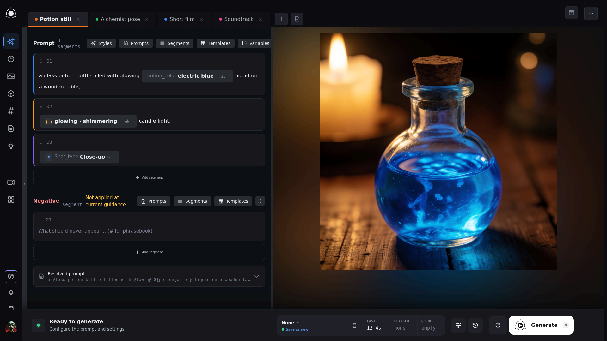
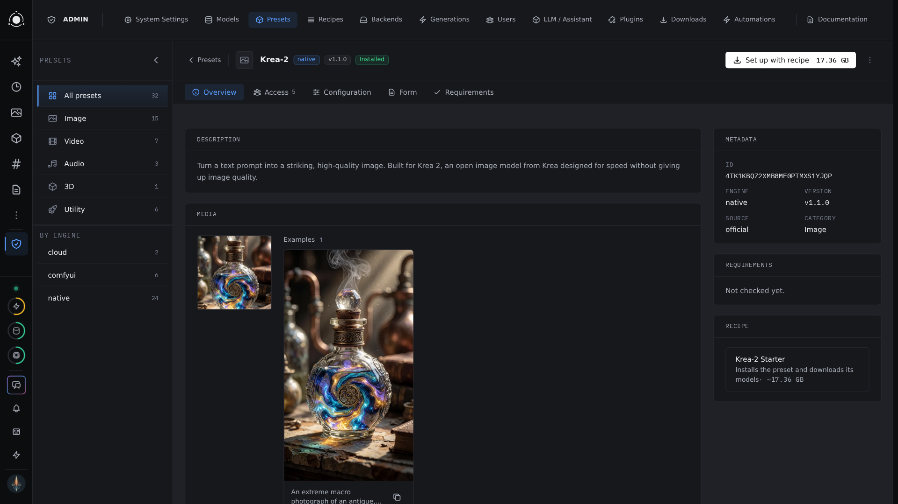
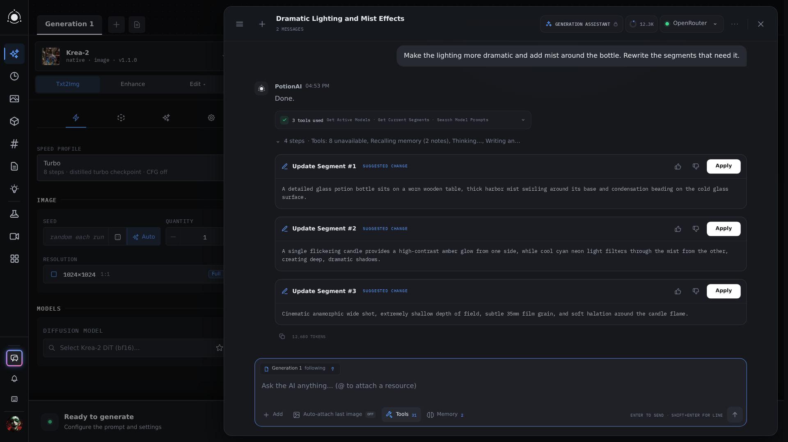
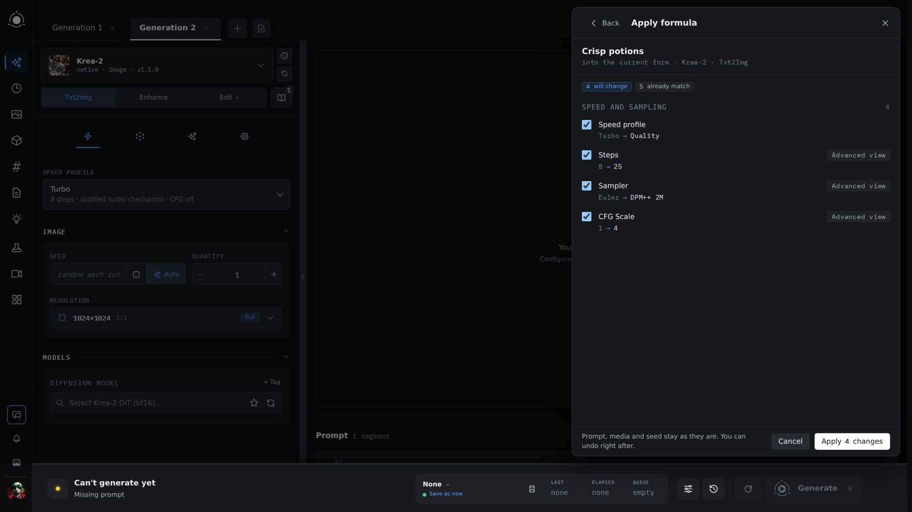
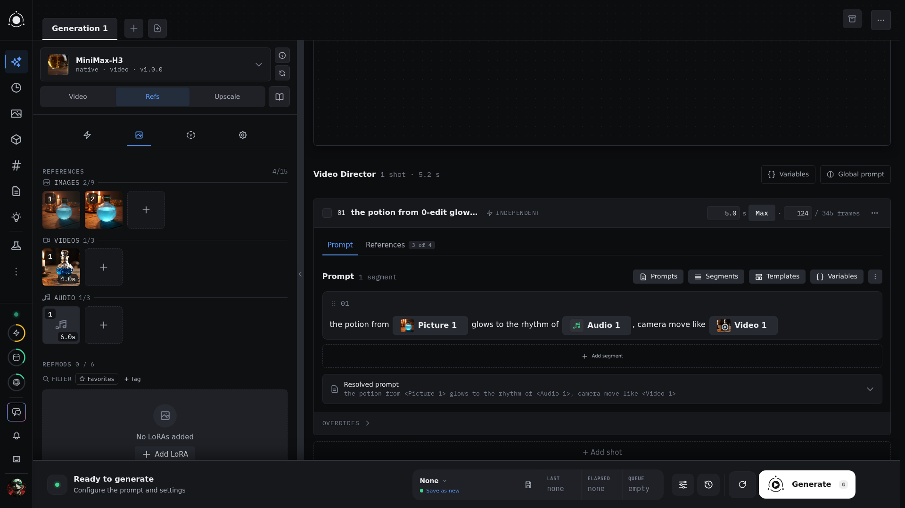
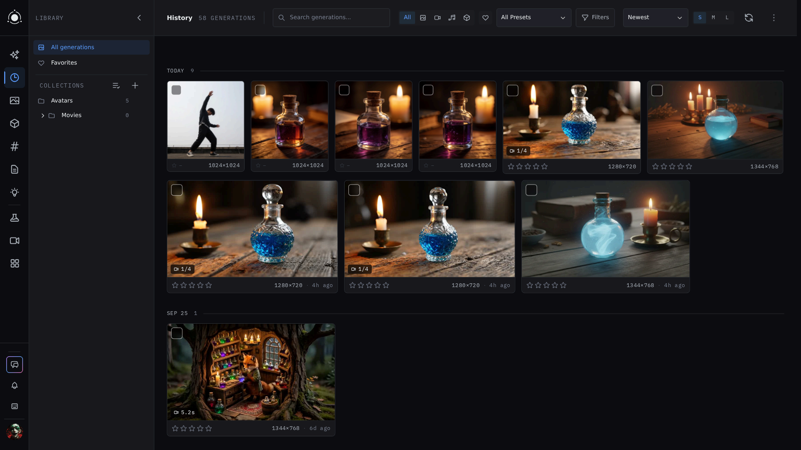
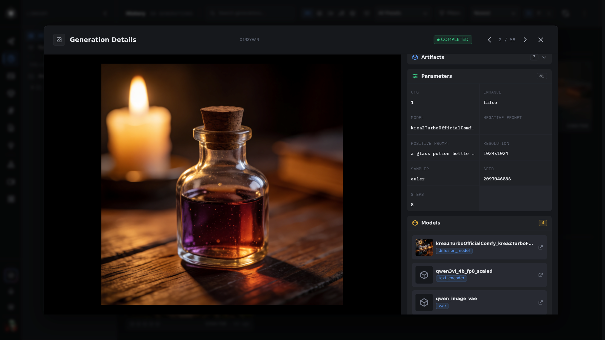
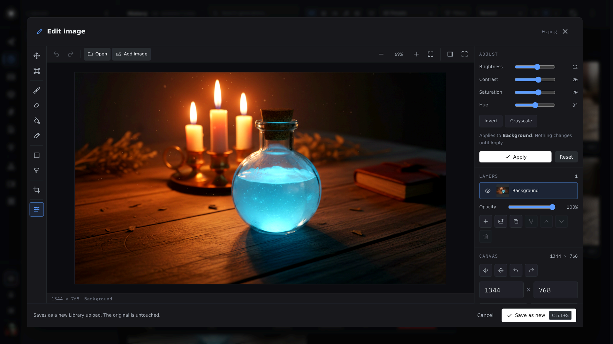
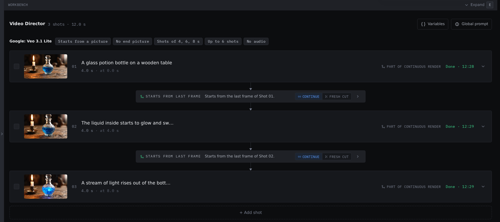
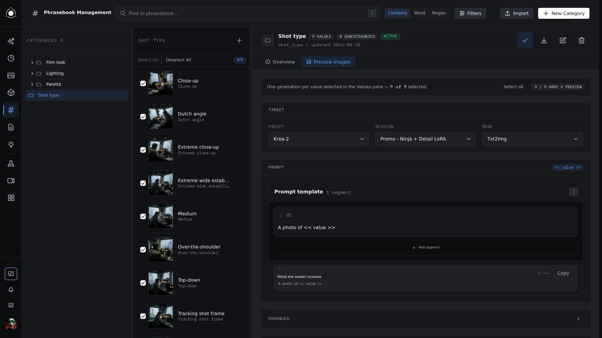

<div align="center">

<picture>
  <source media="(prefers-color-scheme: dark)" srcset="docs/media/brand/potionui-mark-light-256.png">
  
</picture>

# PotionUI

**The self-hosted generation studio you can hand to other people.**

Images, video and music on your own GPU · Free and open source · Linux & Windows

[](https://github.com/PotionUI/PotionUI/releases)
[](https://github.com/PotionUI/PotionUI/actions/workflows/backend-tests.yml)
[](LICENSE)
[](https://github.com/PotionUI/PotionUI/stargazers)
[](#install)

[](https://discord.gg/avR4trp3b8)
[](https://www.reddit.com/r/PotionUI/)
[](https://ko-fi.com/A3B325D031)

**[Install](#install)** · [Quick start](#60-seconds-to-first-image) · [Website](https://potionui.com) · [Docs](https://potionui.com/docs) · [Changelog](#changelog) · [Contributing](CONTRIBUTING.md) · [Security](SECURITY.md)

Run Krea-2, Anima, SDXL, Flux, Wan, LTX, Qwen-Image, MiniMax and YuE2 on one box — then give your team, your household, or your agents their own logins, presets, and limits. No node graphs. No per-model setup. Pick a model, type, watch it render live.



<details>
<summary>Watch the 60-second tour (video)</summary>

https://github.com/user-attachments/assets/950415f7-da97-403e-811b-4c9c41d8106f

</details>

</div>

**Why PotionUI:**

- **Forms, not wiring** — each model exposes only the controls it actually
  understands.
- **Accounts, groups, admin panel** — one GPU, many users, per-user presets
  and model access.
- **Drive it from Claude Desktop or any MCP client** — per-user tokens; every
  write action needs your approval.
- **Video Director** — compose shots in sections instead of one giant prompt.

*Alpha 0.0.15 · Linux x86_64 + NVIDIA · Windows native (experimental), WSL2 or
Docker ·
[Discord](https://discord.gg/avR4trp3b8) · [Reddit](https://www.reddit.com/r/PotionUI/) ·
[Ko-fi](https://ko-fi.com/A3B325D031)*

## 60 seconds to first image

```bash
git clone https://github.com/PotionUI/PotionUI.git potionui && cd potionui
./potionui doctor    # check prerequisites, with a repair command for anything missing
./potionui start     # create the venv, install deps, launch backend + frontend, print the URL
```

Native Windows (experimental): `.\potionui.cmd doctor` and `.\potionui.cmd start`
from PowerShell or cmd — see [Windows (native)](#windows-native).

Floor: 8 GB VRAM + 16 GB RAM (SDXL). Full requirements below.

## Contents

- [What you're looking at](#what-youre-looking-at)
- [Multi-user, with an admin panel](#multi-user-with-an-admin-panel)
- [AI assistant](#ai-assistant)
- [The generate workspace](#the-generate-workspace)
- [History, tags, and collections](#history-tags-and-collections)
- [Video Director](#video-director)
- [Prompt tooling](#prompt-tooling)
- [Automations](#automations)
- [Plugins](#plugins)
- [Install](#install) — [supported platforms](#supported-platforms),
  [manual setup](#running-backend-and-frontend-separately)
- [Documentation](#documentation) · [Changelog](#changelog)
- [Contributing](#contributing) · [Support](#support) · [License](#license)

## What you're looking at

- **Pick a model, get the right controls** — each model ships a form with only
  the controls it understands: resolution, camera angle, art style, whatever
  applies.
- **Watch it happen live** — step-by-step progress, streaming previews, and a
  gallery that fills in as results land.
- **One app for all of it** — images, video, and audio side by side, no
  per-model setup.

| Model family       | What it does                      | Docs                                                           |
| ------------------ | --------------------------------- | -------------------------------------------------------------- |
| SDXL               | Image (txt2img, inpaint)          | [docs/models/sdxl.md](docs/models/sdxl.md)                     |
| Flux (1 / 2 Klein) | Image (txt2img, img2img)          | [docs/models/flux.md](docs/models/flux.md)                     |
| Qwen-Image         | Image (txt2img, img2img, edit)    | [docs/models/qwen_image.md](docs/models/qwen_image.md)         |
| Krea-2             | Image (txt2img, enhance)          | [docs/models/krea2.md](docs/models/krea2.md)                   |
| Z-Image            | Image (txt2img)                   | [docs/models/z_image.md](docs/models/z_image.md)               |
| Anima              | Image (txt2img)                   | [docs/models/anima.md](docs/models/anima.md)                   |
| Wan 2.1 / 2.2      | Video                             | [docs/models/wan.md](docs/models/wan.md)                       |
| LTX-2 / 2.3 / 2.5  | Video (with audio), video upscale | [docs/models/ltx.md](docs/models/ltx.md)                       |
| MiniMax-H3         | Video (with reference images)     | [docs/models/minimax_h3.md](docs/models/minimax_h3.md)         |
| MiniMax-Music3     | Audio (song)                      | [docs/models/minimax_music3.md](docs/models/minimax_music3.md) |
| YuE2               | Audio (song, lyrics + style tags) | [docs/models/yue2.md](docs/models/yue2.md)                     |
| SeedVR2            | Image & video upscale / restore   | [docs/models/seedvr2.md](docs/models/seedvr2.md)               |

## Multi-user, with an admin panel



PotionUI is built for more than one person on the same box:

- **Users and groups** — create accounts, group them, and assign presets,
  models, and LLM configurations per user or to a whole group at once.
- **Presets under control** — decide who sees which preset, and reshape any
  preset's form per mode: change defaults, lock fields, or hide them
  entirely, no YAML editing required.
- **Backends** — configure where generations run and let users pick between
  enabled backends.
- **LLM setup** — wire up the providers behind the assistant (Ollama,
  OpenRouter, …) and hand them out per user or group.
- **Models, plugins, settings** — manage installed models and downloads,
  toggle plugins, and set global options, all from the same panel.

The full tour: [docs/user/admin.md](docs/user/admin.md).

## AI assistant



- Configure a language model and get an assistant beside generation: it
  brainstorms and rewrites prompts, edits phrasebook values, adjusts form
  state — **with your approval on every action that changes something**.
- The same tools are reachable from outside the app: PotionUI mints per-user
  [Model Context Protocol](https://modelcontextprotocol.io) tokens, so an MCP
  client (Claude Desktop, an agent, your own tooling) can drive your instance
  directly.

## The generate workspace

<!--
SCREENSHOT SLOT — GENERATE / VIDEO PRESET
A video preset selected (Wan or LTX), curated form visible (resolution,
frames, sampler), generation in progress with the live streaming preview
and a step progress bar mid-run.
-->



- Every tab is its own sandbox — preset, mode, prompts, and results — so you
  can run several ideas side by side without losing any of them.
- Switch models and the form swaps to match; the same tab handles txt2img,
  img2img, inpainting, or a video/audio mode.
- Like a setup? Save it as a **session** — preset, mode, prompts, and form
  values — and pull it back up any time.
- Save the settings that worked as a **formula** and apply them in any
  session, with a preview of exactly what changes.
- One media field holds reference images, videos, and audio in their own
  groups; type **@** in the prompt to use any of them.



## History, tags, and collections







https://github.com/user-attachments/assets/f46cde26-0288-4e05-ac90-c3be31f0d2dd

- Everything you generate is saved automatically, with the exact parameters
  that produced it.
- Tag generations to group and re-find them; bulk-delete by tag to clear out
  throwaway experiments.
- Sort work into collections, and compare two results side by side.
- Fix a picture without leaving the app: Tools → Edit image adjusts, crops,
  paints, and layers it, then saves a new copy. The same editor opens from
  any media field in a preset form.

## Video Director



- Build a shot out of **global, timed, and chained sections** instead of
  hand-managing separate prompt fields per segment.
- Same segment-card editor as everywhere else in PotionUI, aimed at a
  timeline.

## Prompt tooling



- **Segments** — save a prompt fragment once, drop it into any prompt; group
  related segments into templates.
- **Phrasebook** — autocomplete for known terms (art styles, camera angles,
  lighting) with per-chip shuffle for quick variation.
- **Dynamic prompts** — `{a|b}`, weighted choices, `${vars}`.
- **LLM enhancement** — optional, layered on the same editor.

## Automations

- Wire **triggers** (schedule, manual, file watcher, GPU VRAM threshold, app
  events) through **conditions** to **actions** (tag, add to a collection,
  assign models or users, backend actions, notifications, indexing) on a
  visual graph.
- Start from an importable template, export as JSON, and read every run's
  history and logs in the same editor.

## Plugins

Nearly every subsystem is an extension point — even alternate inference
backends are plugins, not core code:

- **Providers** — credentialed connections to model marketplaces (e.g. CivitAI)
- **Backends** — configured instances of an inference engine (e.g. a ComfyUI
  server via the `comfyui-backend` plugin, which also ships image presets for
  SDXL, Qwen-Image, Z-Image, Krea-2, and Flux Klein 9B); you can import your
  own ComfyUI workflows as presets too — see
  [docs/presets/comfyui.md](docs/presets/comfyui.md); hosted cloud models
  come from the `openrouter-provider`, `bfl-provider`,
  `google-gemini-provider` and `openai-provider` plugins, each with its own
  presets — see [docs/cloud-models.md](docs/cloud-models.md)
- **Pipes** — the individual steps a generation pipeline is built from
- **Field types, chat modes, frontend pages** — all pluggable

Plugin code imports only from `src/plugin_api/`. Authoring reference:
[docs/plugin-api.md](docs/plugin-api.md).

## Install

> [!WARNING]
> PotionUI is in **alpha**: expect rough edges and breaking changes between
> releases. Back up anything you care about, and report what breaks — issues
> and Discord reports steer what gets fixed next.

> [!IMPORTANT]
> **Linux x86_64 with an NVIDIA GPU** is the tested 0.0.15 matrix. **Native
> Windows is supported experimentally** as of 0.0.8: the installer, the CLI,
> the backend test suite, the frontend checks and the E2E harness all run in
> CI on `windows-latest` — see [Windows (native)](#windows-native) below.
> WSL2 and Docker Desktop work too. Details in
> [Supported platforms](#supported-platforms).

PotionUI can generate on this machine's GPU, dispatch to a remote worker, or
both — the `./potionui` CLI has an install preset for each.

**Pick an install:**

| You have                                              | What gets installed                                                 | Command                             |
| ------------------------------------------------------ | ----------------------------------------------------------------- | -------------------------------------- |
| A GPU in this machine                                 | Full CUDA stack                                                    | `./potionui start`                     |
| A GPU here, plus room to add remote workers later      | Full CUDA stack                                                    | `./potionui start --profile hybrid`    |
| No GPU here (a VPS or laptop) — dispatch to a worker    | CPU-only PyTorch, no CUDA libraries — **not** a CPU-generation mode | `./potionui start --profile remote`    |
| A GPU box that only serves another PotionUI instance    | Full CUDA stack, no frontend                                       | `./potionui worker start`              |

On native Windows every command reads `.\potionui.cmd …` instead of
`./potionui …`; the profiles are the same.

You need:

- **Python 3.12** (3.13 works only by compiling numpy from source; the shim prefers 3.12 when both exist), and **Node.js 18+** for every preset except Worker.
- Floor: **8 GB VRAM + 16 GB RAM** (runs the SDXL family) on any preset that
  installs the CUDA stack. Larger families need more, some considerably more
  — see [Hardware Requirements](docs/user/hardware-requirements.md).

```bash
git clone https://github.com/PotionUI/PotionUI.git potionui && cd potionui
./potionui doctor    # check prerequisites, with a repair command for anything missing
./potionui start     # create the venv, install deps, launch backend + frontend, print the URL
```

- `./potionui start` is idempotent and supervises both processes; `./potionui stop`
  or Ctrl-C cleans them up together.
- `./potionui status` reports whether an instance is up; `./potionui doctor`
  names any problem and its fix.

### Supported platforms

| Platform                    | Status                                                                                      |
| --------------------------- | ------------------------------------------------------------------------------------------- |
| Linux x86_64 + NVIDIA CUDA  | Tested and supported for 0.0.15                                                              |
| Windows via WSL2            | Should work — same Linux CUDA stack, just unverified; a success/failure report would help   |
| Windows native              | Experimental (0.0.8) — installer, CLI, backend suite, frontend checks and E2E harness run in CI on `windows-latest`; see [Windows (native)](#windows-native) |
| macOS                       | No — local generation needs CUDA; the native engine has no MPS support                      |
| AMD GPU (ROCm)              | No — the pinned dependency stack is CUDA-only                                               |
| Docker                      | Supported — see below (on Windows, Docker Desktop runs this via WSL2)                       |

### Windows (native)

Experimental as of 0.0.8. The `windows-latest` GitHub Actions workflow
([`.github/workflows/windows.yml`](.github/workflows/windows.yml)) covers
the install and test matrix below.

**Prerequisites:**

- Python 3.12 from [python.org](https://www.python.org/downloads/windows/)
  (the `py` launcher works too; 3.13 is not yet usable because the pinned
  numpy has no 3.13 wheels).
- Node.js 20.
- Git.
- For GPU generation: an NVIDIA driver version 580 or newer (the floor the
  CUDA 13 torch build in `constraints.txt` needs — see
  [Hardware Requirements](docs/user/hardware-requirements.md)).

```powershell
git clone https://github.com/PotionUI/PotionUI.git potionui
cd potionui
.\potionui.cmd start
```

**Exercised in CI on `windows-latest`:** `doctor`; the `remote` install
profile (CPU-only PyTorch, no CUDA) booting end to end — install, backend
start, health check, owner registration, preset listing, stop — on a fresh
checkout; the full backend pytest suite and the marketplace plugin suites;
the release gate without GPU steps; the frontend type-check, unit, component
and build steps; and the HTTP + Playwright E2E harness.

**Known limitation:** Triton and `torch.compile` have no Windows wheels, so
attention runs on plain SDPA and the compile optimizations stay off.

**Reporting a Windows issue:** open a GitHub issue with:

- The output of `potionui.cmd doctor --json`.
- The files under `logs/`.
- The output of `nvidia-smi`.
- What happened when you generated with the smallest available preset.

```bash
docker run --gpus all -p 26730:26730 ghcr.io/potionui/potionui:latest
```

Requires an NVIDIA GPU +
[nvidia-container-toolkit](https://github.com/NVIDIA/nvidia-container-toolkit);
volumes and details in [`docker/README.md`](docker/README.md).
(`./potionui start-docker` runs the contributor-facing dev harness instead.)

### Running backend and frontend separately

Useful when iterating on one side only, or if `./potionui` doesn't fit your
setup:

```bash
# Backend
python -m venv venv
source venv/bin/activate          # Windows (native, experimental): venv\Scripts\activate
pip install -r requirements.txt -c constraints.txt
python api.py                     # serves on http://localhost:26730

# Frontend
cd frontend
npm install
npm run dev                       # dev server on http://localhost:26731
```

Or run both together with `./run.sh` (assumes the venv and `node_modules` are
already installed — `./potionui start` does not):

```bash
./run.sh                          # backend :26730, frontend :26731
./run.sh 26730 26731 --lan        # also accept connections from the local network
```

### Logs

Console output is mirrored to a rotating log file at `storage/logs/potionui.log`.
Tune it with `POTIONUI_LOG_LEVEL` (default `INFO`), `POTIONUI_LOG_DIR` (default
`storage/logs`, empty disables the file), `POTIONUI_LOG_MAX_BYTES` (default
20 MB) and `POTIONUI_LOG_BACKUP_COUNT` (default 10), or turn the file off
outright with `POTIONUI_LOG_FILE=off`. Details in
[Administration → Server logs](docs/user/admin.md#server-logs).

## Documentation

Start with the in-app documentation browser, or read the Markdown directly:

- **[Getting started](docs/user/getting-started.md)** — first login to first
  image, plus the rest of the `docs/user/` guide.
- **Reference** in `docs/`: [presets](docs/presets.md),
  [prompts](docs/prompts.md), [backends](docs/backends.md),
  [providers](docs/providers.md), [native engine](docs/native-engine.md),
  [models](docs/models.md), [video director](docs/video-director.md),
  [music director](docs/music-director.md), and per-model / per-technique
  docs under `docs/models/` and `docs/techniques/`.

## Changelog

The three most recent releases; older history lives in the
[commit log](https://github.com/PotionUI/PotionUI/commits/master).

### 0.0.15 — 2026-10-08

- X/Y compare: a Compare button in the Generate dock turns any form into a grid; pick the fields
  for the X and Y axes, give each its values, and one Generate runs a cell per combination; the
  Workbench fills the grid live with each cell's time, video grids play in sync, and a finished
  grid can be stitched into one image; History keeps a grid as one stack card that opens the grid,
  and each cell's details say which X and Y values it used; axes follow what the chosen model
  supports, including cloud options such as aspect ratio and quality, and the phone Studio view
  shows the grid too.
- Photo filters: the image editor has a Filters tool with twelve built-in looks, an intensity
  slider and fine-tuning; a look you like can be saved as your own filter, kept per user; plugins
  can add filters and the operations behind them, and filters render the same in the browser and
  on the server.
- Auto-organize: per-user rules file new generations, uploads and models into collections and
  tags; a rule can match media kind, size and aspect, and for models their name, file name,
  description, trigger words, source, file size and custom attributes; preview a rule before
  saving, apply it to existing items, and undo from its activity list; collections now include
  sub-collections by default, with direct-only, Unsorted and Favorites filters and rolled-up
  counts in History, Library, Models, Inspirations and Prompts, and prompts can be favorited.
- Plans and limits: admins can cap storage, daily generations, monthly cloud spend and the size of
  a single upload per user, through a default plan, group plans and personal overrides; users see
  their plan and usage in Settings, a limit bar in the account menu and a storage card in History
  with Review largest generations, and a refused generation or upload says why with a live
  countdown; deleting a plan in use offers to reassign its users.
- Cloud models: three new provider plugins join OpenRouter; OpenAI runs GPT Image text to image
  and edit with references and a painted mask, Google Gemini runs Nano Banana image and Veo 3.1
  video models, and Black Forest Labs runs FLUX models, each with its own preset and setup guide;
  the cloud catalog can show suggested models and links to each model's page; changing the engine
  in Add backend keeps the name, enabled flag, priority and scheduling.
- Accounts: one browser can hold several accounts and switch between them from the user menu or
  the phone Accounts sheet, each with its own tabs and saved state; with the OIDC plugin, Add
  account can offer another identity; the user panel groups its entries into Accounts, Workspace,
  Content and Session.
- Generate: the header is one row with the preset picker, a mode select with plain mode names,
  short descriptions and optional icons, and formulas; the form hides its tab bar when only one
  tab is visible; the negative prompt hides while the current guidance would ignore it, and
  presets can declare this per mode; the Resolved prompt row shows variable values and marks the
  ones that re-roll per image; prompt header actions collapse into the More menu as the pane
  narrows; a picked model clears in one click in filters and optional model fields, and History
  filters pick a model with the model picker.
- History and Library: each card has a Delete button and an item actions menu in place of the
  quick-action row, and the controls stay readable on any image; the media field's History picker
  offers every file of a generation as its own tile.
- Native engine: LoRAs on fp8 and nvfp4 models are added in one fused step instead of slowing
  every layer, and LoKr adapters stay on the fast path; LTX-2.5 IC-LoRA references accept videos
  in Video Director, honour the LoRA's reference scaling, steer the first pass only with an
  optional refine-pass toggle, and work with Upscale; engine tuning (attention backend, compile,
  prefetch and similar) lives in each native backend's Optimizations tab and is sent to remote
  workers with every job, and profiling is a Diagnostics setting.
- 3D: a new Pixal3D preset turns one image or four views into a textured mesh, estimating the
  camera's field of view on its own; TRELLIS.2 mesh export is several times faster, with UV unwrap
  in seconds instead of minutes and cleanup in a separate process so the server stays responsive;
  it remeshes and bakes textures the way upstream does, defaults to 300k faces with up to 1M
  available, and no longer exports a vertically mirrored texture.
- Chat and MCP: MCP tools work without an open browser tab (list presets and models, edit
  segments, templates and phrasebook categories, search the gallery by text); prompts can be read
  and listed from MCP and chat; library listings are complete and respect hidden generations;
  tool, streaming, automation and notification failures show regular users a plain message and
  admins the detail.
- Plugins: a plugin can declare setup steps, and one with setup left shows a Setup needed badge
  and a Setup section with the next step first; plugin admin tabs can draw their own page with a
  left menu; plugins can add Auto-organize conditions and actions and their own limit kinds.
- Admin: assigning users, groups, resource access and plans uses one shared picker with whole-row
  toggle, shift-click ranges and keyboard control; Auto-organize has an admin page with Overview,
  Limits and People; presets show where they were loaded from.
- Fixes: Edit image on a media field works right after an upload and is not offered while the
  upload is still processing; a chosen sampler survives closing the form, switching tabs and
  reloading a session; switching Krea-2 NAG off really turns it off; a generation cancelled just
  as a queue slot frees no longer starts, so a cancelled cloud run never reaches the provider; two
  PotionUI instances on one host no longer break each other's images; model previews picked from
  History show for every user the model is assigned to; failed generations tell regular users what
  happened in plain words; new generation tabs never show the previous tab's form; the phone
  Settings sheet fills in its tabs once the server answers; phrasebook chips on wrapped lines no
  longer overlap; the Trim end handle is no longer clipped; daily limits work on Windows.
- Upgrading: generated images, uploads, run reports, inspirations and avatars now need a signed-in
  viewer, so other users get a 404 and a bare media link opened outside a logged-in browser no
  longer loads; engine tuning set through environment variables is copied into Admin settings on
  first start and the variables are ignored afterwards (a startup warning names any still set), so
  change it in each native backend's Optimizations tab; tzdata is a new requirement, so reinstall
  requirements on a manual install.

### 0.0.14 — 2026-10-02

- Cloud models: a new OpenRouter plugin lets presets run on hosted image and video models such
  as Nano Banana and Veo 3.1 Lite, with results landing in the same History; admins refresh a
  backend's model catalog, see prices, enable models and limit them to chosen presets; the form
  shows only the controls the chosen model supports, with a Provider options field for its
  extras; jobs report progress, can be cancelled with a notice when the provider may still finish
  and bill, never bill twice on a retry, and record their cost for admins with spend per backend
  and model; cloud backends run several jobs at once.
- Video Director on cloud models: each hosted model brings its own limits, a film of several
  shots makes one request per shot and can continue each shot from the last frame of the one
  before, the shots are joined into one film, and retrying a failed shot redoes only that shot
  (a full redo asks first and shows the price to admins).
- Image editor: images can be edited and drawn in a built-in editor with layers, brush and
  eraser, selections, crop, flip, rotate, resize and colour adjustments, opened from a media
  field, History and Library (Tools → Edit image), the generation details view or the Library
  item view; the result is saved as a new Library upload and the original stays untouched.
- Formulas: the settings of a preset mode can be saved as a formula and applied in any session,
  with a preview of every value that will change, a mark on what changed, and one click to undo;
  every marketplace and ComfyUI preset declares which settings belong in a formula.
- Media fields: a redesigned field with one large preview, a Tools menu and file details, a
  numbered strip for several items, and one field that can hold images, videos and audio in their
  own groups; type @ in a prompt to cite any of them; MiniMax-H3 references are now one such
  field, and old sessions and saved prompts are converted when loaded; Crop, Trim and Frame only
  add the edited result to the Library, never the unedited original.
- Qwen-Image 2.1: a Control mode with Fun ControlNet Union guides (canny, depth, pose and more)
  and inpainting from one image with an optional mask; the extracted guide can be saved next to
  the result as a labelled image, or extracted on its own without a prompt or image models; the
  workbench shows the guide with its label beside the result.
- Generate: three-pane mode folds the form on narrow screens and gives its width to the prompts;
  dropdowns open above the Generate bar and work with the arrow keys; preset forms show and hide
  fields for the value just picked; video presets have animated covers, and every cover zooms
  slightly on hover.
- Chat: attaching an image uses the same picker as a preset form.
- Admin: a panel from the System Monitor shows every backend's status, jobs and hardware; the
  System Monitor is admins only unless an admin opens it to everyone; plugins are grouped by what
  they add; preset overrides say when a stored default is ignored and why.
- Plugins: plugins can run generations, read preset forms, prepare requests from saved sessions,
  use every app UI component and the app's list page and details viewer, and probe or re-encode
  short videos.
- Fixes: Enter in the session name saves the session and no longer resets the workspace; painted
  inpaint masks reach the model; previews survive a reload with Windows paths or storage under a
  tmp folder; regular users see a plain reason when a generation fails to start or prepare,
  never server paths or error text; OpenRouter image models keep their aspect ratio choice; the
  ControlNet preprocessors are installed with the requirements.
- Upgrading: plugin manifests must use one of the current categories, and a plugin with an old
  category name no longer loads; the Docker setup no longer has an outputs volume, since all
  generated work lives in the storage volume; cloud models need the OpenRouter plugin enabled and
  its API key set in Admin → Plugins.

### 0.0.13 — 2026-09-30

- Model folders: adding a folder detects which tool it belongs to (ComfyUI, A1111/Forge/SD.Next,
  StabilityMatrix, Fooocus, SwarmUI, Pinokio) and maps its subfolders to model types, with an
  override; a type can use several subfolders of one folder (such as Lora and LyCORIS) with one
  of them receiving downloads; folders the tool's own config points to are offered as extra
  folders, including Windows drive paths seen from WSL; any subfolder can be bound to a type by
  browsing or typing a path, in the setup wizard and in Admin → Models → Folders; Detect again
  adds only what is missing, and a single subfolder can be removed.
- Model types: checkpoints and diffusion models sharing one folder, as in Forge and
  StabilityMatrix, are told apart by reading the file header; Flux, Qwen, Z-Image, Krea-2, Wan,
  Anima, SeedVR2 and MiniMax-H3 pickers also list full checkpoints of those models and load only
  their diffusion model weights; files nothing recognises are listed as needing a type, and
  admins can set or reset a model's type from its detail page, kept across rescans; ComfyUI's
  unet and latent_upscale_models folders count as diffusion models and upscalers.
- Content safety: every model can be Allowed, Blurred or Blocked per instance and per user
  group, with a Restricted content group that is always blocked; outputs are rated by the image
  tagger before they are saved or sent, and a blocked generation shows a calm notice with the
  reason.
- Sessions: sessions open in a drawer with search, a current-session card with Save, Save as
  new and New, and a history whose rows show the prompt and what changed; sessions can be
  pinned to the top.
- Admin: Admin → Generations shows every running and queued generation from all users,
  including recipe test renders, with Stop, Remove and Stop all.
- Windows: `./potionui start` falls back to a free port when the default is taken, and
  `doctor` names the process holding a port and checks for the Visual C++ runtime that PyTorch
  needs.
- Fixes: model downloads trust the operating system certificate store on Windows and macOS
  (`SSL_CERT_FILE` overrides it), and a certificate failure stops retrying and explains the fix;
  downloads use the detected provider and appear in lists as soon as they finish; stopping a
  generation really stops it, never reports cancelled when the backend refused, and a stop
  sent just before a run starts is honoured; recipe downloads can be approved when a provider
  has no API key yet; plugin settings and new model folders no longer crash on empty fields;
  the NSFW setting saves again; clearing all chat sessions in Admin works again.
- Upgrading: the default ports change to 26730 (backend) and 26731 (frontend) because Windows
  Delivery Optimization holds 7680; set `BACKEND_PORT`/`FRONTEND_PORT` or pass
  `--backend-port`/`--frontend-port` to keep the old ports, and update bookmarks to
  `localhost:26731`; the database gains model type, folder binding, session pin and content
  policy migrations on first start, so take a backup first.

## Contributing

- **[CONTRIBUTING.md](CONTRIBUTING.md)** — dev setup, test and lint commands,
  PR expectations.
- `CLAUDE.md` — the deeper architecture reference; its package-layering rules
  are enforced by `tests/architecture/test_layering.py`, so boundary-crossing
  code fails CI.
- Security issue? See [SECURITY.md](SECURITY.md).

## Support

If PotionUI is useful to you, a [Ko-fi](https://ko-fi.com/A3B325D031)
contribution helps keep it going, and the
[Discord](https://discord.gg/avR4trp3b8) is where development happens in the
open. News, showcases and questions also go to
[r/PotionUI](https://www.reddit.com/r/PotionUI/).

## License

- PotionUI is **GPL-3.0** — see [LICENSE](LICENSE).
- Third-party code is bundled under `vendor/`, each component keeping its own
  upstream license; the GPL-3.0 components among it set the project-wide
  license. Full attribution: [vendor/NOTICE.md](vendor/NOTICE.md).
- **No model weights are distributed** — models download only at your explicit
  request, each under its own license, separate from PotionUI's. See
  [Models & licensing](docs/user/models.md#model-licensing).

---

[Docs](docs/user/getting-started.md) ·
[Discord](https://discord.gg/avR4trp3b8) ·
[Contributing](CONTRIBUTING.md)
