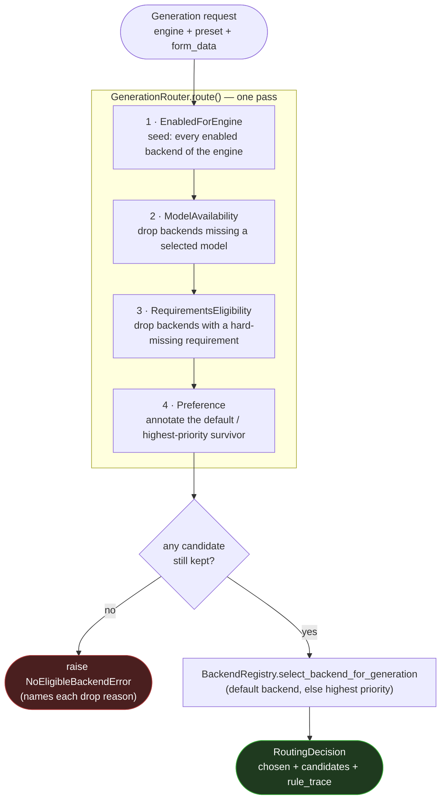
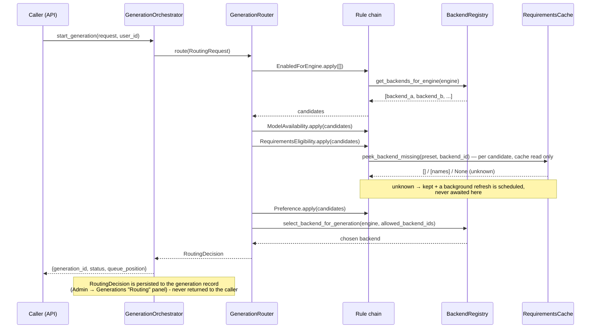

# Generation Routing

`src/features/generation/routing/` decides which **enabled backend of a preset's engine** executes
one generation. It exists because "which backend" stopped being a one-line question the moment more
than one backend can provide the same engine: a selected model can live on only one of several
backends, and a backend can be missing something the preset needs (a ComfyUI custom node, say).
`GenerationRouter` answers all of that in one pass, and explains itself — every candidate it
considered, kept or dropped, carries a reason.

The router sits directly above `BackendRegistry.select_backend_for_generation` (docs/backends.md
"Backend selection"), which stays the single, tested implementation of the final "default backend,
else highest priority" tie-break — the router narrows the field down to who's *eligible*, then hands
the survivors to that method rather than re-deciding the tie-break a second way.

## The rule chain

A `GenerationRouter` is a list of `RoutingRule`s folded over a candidate list, one rule at a time.
The first rule seeds the list from every enabled backend of the request's engine; every rule after
that either **drops** a candidate (recording why) or **annotates** it (a preference, a caveat) —
never adds one back. What's left when the chain ends is who gets to compete for the actual pick.



Every rule can see every candidate still in play and the full request, so a later rule's decision
can depend on an earlier one implicitly (e.g. `Preference` only ever annotates *survivors*) — but no
rule ever needs to know what an earlier or later rule does. That's what makes the chain
composable: a plugin drops its own rule in anywhere without touching the others.

## Sequence: one generation start



## Decision table: what each rule does

| Rule | Can it drop? | Can it annotate? | Why it exists | When it fires | Example reason text |
|---|---|---|---|---|---|
| `EnabledForEngine` | no (seeds) | no | Every other rule needs a starting candidate list | Always, first | *(none — it only seeds)* |
| `ModelAvailability` | yes | no | A selected checkpoint/LoRA may only be downloaded to one backend | The form references `model:<id>` values AND at least one backend of the engine has been indexed | `"does not hold every selected model"` |
| `RequirementsEligibility` | yes | yes | A backend can lack something the preset needs (a ComfyUI custom node, a model file) — see [Preset Authoring Guide](presets.md) "Requirements" | The preset declares `requirements:` AND a requirements cache is wired | `"missing requirement(s): FaceDetailer node"` (dropped) / `"requirements not yet checked"` (kept, refresh scheduled) / `"requirements satisfied"` |
| `Preference` | no | yes | Explains which survivor the final pick will choose, without re-deciding it | At least one candidate survived | `"default backend for this engine"` / `"highest priority (5) among eligible backends"` |

`ModelAvailability` and `RequirementsEligibility` never treat "can't tell from here" as a reason to
drop — an unindexed backend or an unchecked requirement is **unknown**, not missing, and stays a
candidate. Both are pure reads: `ModelAvailability` reads the model-availability index,
`RequirementsEligibility` reads the requirements cache's *last evaluated* verdict — neither ever
blocks the chain on live work. See "Requirements interplay" below.

## Worked examples

**Single backend.** One enabled `native` backend, no model refs, no requirements. Every rule
after `EnabledForEngine` is a no-op; `Preference` annotates it as the only survivor (there being no
other candidate to prefer over); the final pick returns it. `rule_trace` shows `before == after == 1`
for all four rules.

**Two ComfyUI backends, one lacking a node.** `comfy-a` and `comfy-b` are both enabled for `comfyui`;
the preset's `requirements:` includes `{type: comfyui_node, class_type: FaceDetailer}`, and the
requirements cache's last check found the node on `comfy-a` but not `comfy-b`.
`RequirementsEligibility` drops `comfy-b` (`"missing requirement(s): FaceDetailer node"`) and leaves
`comfy-a` the only survivor — chosen regardless of which one is marked default or has higher
priority. If `comfy-b` is the default and BOTH backends were missing the node, the candidate list
empties and `route()` raises `NoEligibleBackendError` naming both backends and the node they lack.

## Reading the trace

`RoutingDecision.rule_trace` is a list of `{rule, before, after, ms}` — how many *live* (non-dropped)
candidates existed before and after each rule ran, and how long it took. `decision.to_trace_dict()`
renders the whole decision as plain JSON:

```json
{
  "chosen": {"backend_id": "comfy-a", "backend_name": "Comfy A"},
  "candidates": [
    {"backend_id": "comfy-a", "backend_name": "Comfy A", "dropped": false,
     "reasons": ["requirements satisfied", "default backend for this engine"]},
    {"backend_id": "comfy-b", "backend_name": "Comfy B", "dropped": true,
     "reasons": ["missing requirement(s): FaceDetailer node"]}
  ],
  "rule_trace": [
    {"rule": "enabled_for_engine", "before": 0, "after": 2, "ms": 0.04},
    {"rule": "model_availability", "before": 2, "after": 2, "ms": 0.12},
    {"rule": "requirements_eligibility", "before": 2, "after": 1, "ms": 0.08},
    {"rule": "preference", "before": 1, "after": 1, "ms": 0.005}
  ]
}
```

`decision.summary()` is the compact form the orchestrator folds into the `rule_trace` persisted via
`generation_repo.update_routing_decision` — the chosen candidate's last annotation, e.g. `"default
backend for this engine"`. This is admin-only data (Admin → Generations "Routing" panel and the
persisted run report); which backend ran a generation is never surfaced to the user who started it.

## Adding a rule from a plugin

Engines are registered through `backend.register` (docs/backends.md "Contributing an engine from a
plugin"); routing rules go through the sibling `backend.register_routing_rules` hook, fired once
when the router is built:

```yaml
# manifest.yml
hooks:
  backend:
    - hook: "backend.register_routing_rules"
      handler: "hooks.routing_hooks.register_rules"
```

```python
# hooks/routing_hooks.py
from src.plugin_api import HookContext
from src.plugin_api.backends import Candidate, RoutingRequest, RoutingRule, register_routing_rule


class PreferCheapestBackend:
    """A RoutingRule is a plain class: `name` plus an async `apply`."""

    name = "prefer_cheapest"

    async def apply(self, candidates: list[Candidate], request: RoutingRequest, ctx) -> list[Candidate]:
        for c in candidates:
            if not c.dropped:
                c.annotate("considered for cost")
        return candidates


def register_rules(context: HookContext) -> HookContext:
    register_routing_rule(context, PreferCheapestBackend(), position="after:preference")
    return context
```

`position` is `"before:<rule name>"`, `"after:<rule name>"`, or omitted to append at the end — the
name is any built-in's (`enabled_for_engine`, `model_availability`,
`requirements_eligibility`, `preference`) or another plugin rule's. An anchor that can't be found
(a typo, or a rule from a since-disabled plugin) falls back to appending, logged, rather than
silently dropping your rule. A rule should stay fast and side-effect-free the same way the built-ins
are: read `ctx` (which carries `backend_registry`/`requirements_cache`/`model_index`/`gpu_monitor`),
never do real network I/O inline, and use `ctx.schedule_background(coro)` for anything that needs
one — the router tracks the task for you.

## Requirements interplay

`RequirementsEligibility` only ever reads what's already been evaluated — see [Preset Authoring
Guide](presets.md) "Requirements" for the full evaluation model. Two things matter for routing
specifically:

- **Host- vs backend-scoped requirements.** A `"host"`-scoped entry (the default — a binary on
  `PATH`, this host's VRAM) is evaluated once for the whole preset, so a miss there would exclude
  every backend identically; it never narrows routing, only the requirements panel surfaces it. A
  `"backend"`-scoped entry (a ComfyUI custom node/model) is evaluated per backend, so a miss there
  narrows routing exactly the way you'd expect — one backend can be eligible while another isn't.
- **Cache-only, never blocking.** `RequirementsEligibility.apply()` calls
  `RequirementsCache.peek_backend_missing()` — a read, never an evaluation. A backend with no cached
  verdict yet reads as **unknown**, stays a candidate, and a refresh is scheduled via
  `ctx.schedule_background` (fire-and-forget, tracked by the router the same way
  `GenerationOrchestrator` tracks its own background tasks) so the NEXT generation on that engine
  sees a real verdict. `?refresh=1` on `GET /api/presets/{id}/requirements` (the admin panel) is what
  actually warms this cache in the common case — routing's own background refresh is the fallback
  for a backend nobody has opened that panel for yet.

## See also

- [Backends and Engines](backends.md) — engine vs backend, `BaseBackendConfig`, `select_backend_for_generation`'s own algorithm.
- [Preset Authoring Guide](presets.md) — "Requirements", including checker `scope` and the per-backend evaluation model.
- `src/features/generation/routing/contracts.py` — the full data model (`RoutingRequest`, `Candidate`, `RoutingDecision`, `RoutingRule`).
- Hooks Catalog (developer docs, live) — `backend.register_routing_rules`'s payload shape alongside every other hook.
